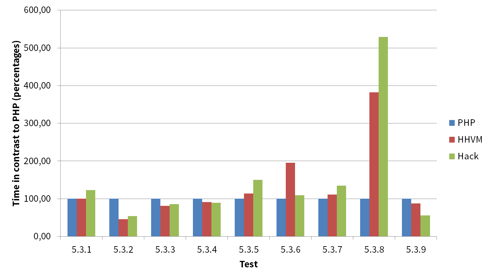
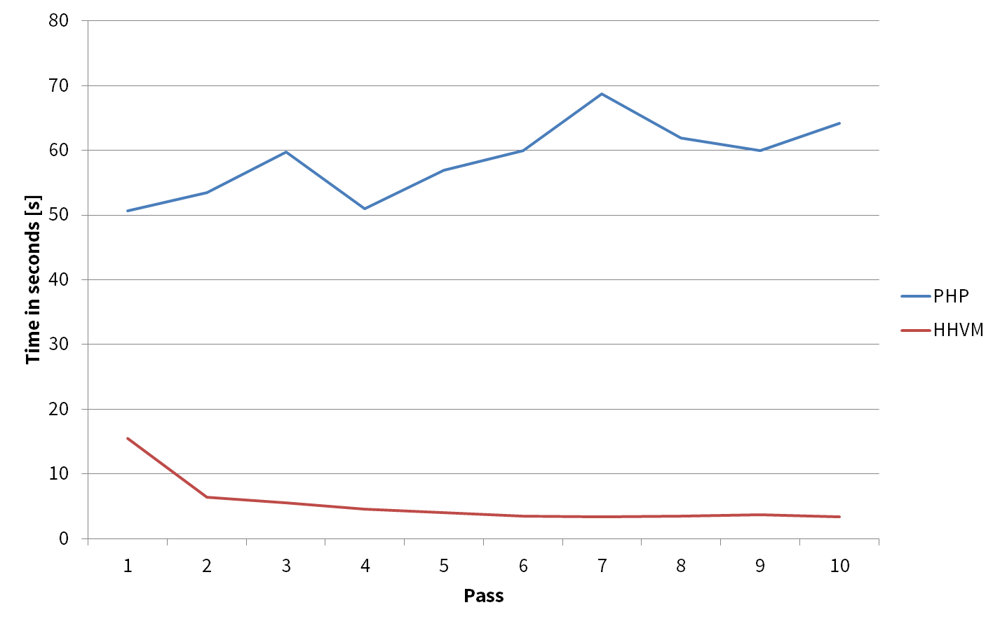
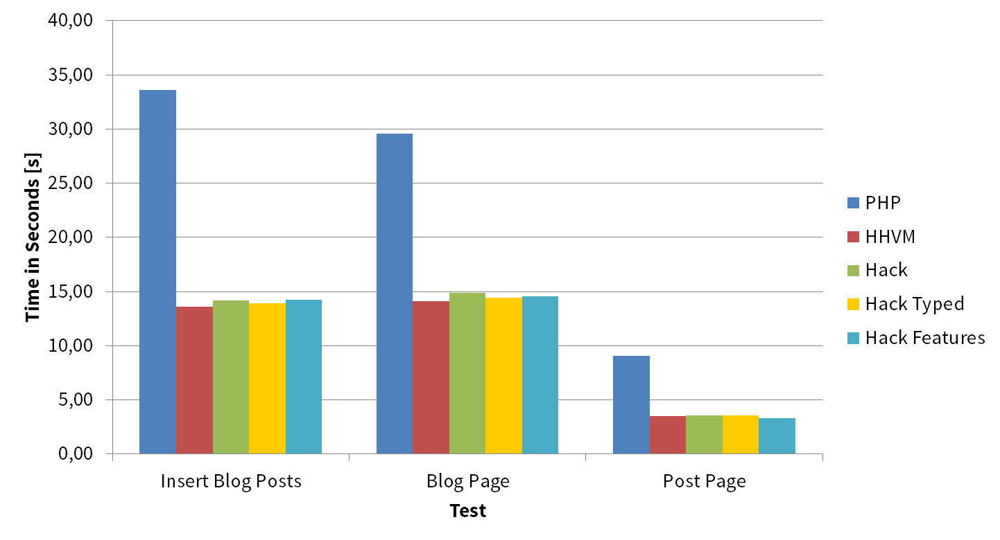

# HHVM and Hack #

This is the repository of the bachelor thesis "HHVM and Hack: Introducing HipHop Virtual Machine and Hack Programming Language in contrast to PHP". The thesis was written in the bachelor course on Media Technology at St. Pölten University of Applied Sciences.

The repository contains the code as used in the paper and the repository is no longer updated. Therefore the script for the blog comes in an extra repository.

Delivery date: 1st June 2014

## Abstract ##

This thesis deals with dynamic web programming, especially with the programming languages PHP and Hack. The Hack programming language was developed by Facebook, released in March 2014 and runs in the HipHop Virtual Machine (HHVM), which was introduced in December 2011. In addition to a brief historical summary of dynamic web programming and an overview about PHP, this work deals with the functions of Hack and the performance of the HHVM and Hack compared to PHP. It discusses performance differences between small typical programming tasks and also between larger projects (WordPress). Moreover a conversion of an existing PHP script to Hack is made and also tested. This thesis shows that the use of HHVM and Hack improve the performance of projects, but the use only worth it at a certain project size.

## Test Results (Charts) ##

In order to determine performance differences between PHP and HHVM/Hack various tests were performed. To measure the time difference the function microtime() and also apaches benchmark tool (ApacheBench, ab) were used. All tests were running in a PHP environment and also the code was executed within HHVM. In addition, if it was possible, the code was converted to Hack (static typing, Hack functions) and tested.

Average test times in contrast to PHP (percentages) on typical programming tasks, found in the root of each folder

Runtime of WordPress performance test in seconds. Comparison between PHP and Hack environment

Runtimes compared of example blog script in seconds

## Folders ##

* PHP: Files used in PHP environment
* HHVM: Files used in HHVM environment
* Hack: Files used in HHVM environment but modified and migrated to Hack
	* blogtest-features: Blog-Script with type annotations and Hack features
	* blogtest-typed: Blog-Script with type annotations
* wordpress: Used as it is on every environment (not included in this repository, because it was a default WordPress 3.9.1 installation)